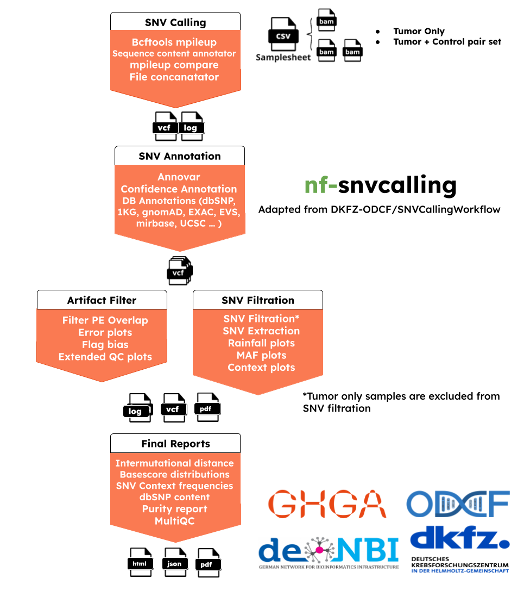

[](https://www.nextflow.io/)
[](https://www.docker.com/)
[](https://sylabs.io/docs/)

<p align="center">
    
</p>

## Introduction

<!-- TODO nf-core: Write a 1-2 sentence summary of what data the pipeline is for and what it does -->

**nf-snvcalling** is a bioinformatics best-practice analysis nextflow pipeline adapted from [**ODCF-OTP SNV Calling**](https://github.com/DKFZ-ODCF/SNVCallingWorkflow) roddy based pipeline for somatic sample analysis.

It calls SNVs from both germline and somatic samples using bcftools mpileup, compares and filters outs germline specific ones with samtools mpileup compare. This workflow uses various annotations from publicly available databases like 1000G variants, dbSNP and gnomAD. The functional effect of the mutations are annotated using Annovar and the variants are assessed for their consequence and split into somatic and non-somatic calls. Besides, extensive QC plots serve functionality for high functional somatic mutation prioritization.

This workflow is optimal to work in ODCF Cluster. The config file (conf/dkfz_cluster.config) can be used as an example. Running Annotation, DeepAnnotation, and Filter steps are optional and can be turned off using [runsnvAnnotation, runSNVDeepAnnotation, runSNVVCFFilter] parameters sequentially.

Users outside of ODCF cluster, should prepare annotation files accordingly (check seq2_testdata_snv/annotations for example) to use whole functionality of this workflow.

The pipeline is built using [Nextflow](https://www.nextflow.io), a workflow tool to run tasks across multiple compute infrastructures in a very portable manner. It uses Docker/Singularity containers making installation trivial and results highly reproducible. The [Nextflow DSL2](https://www.nextflow.io/docs/latest/dsl2.html) implementation of this pipeline uses one container per process which makes it much easier to maintain and update software dependencies.

**Important Notice:** The whole workflow is only ready for DKFZ cluster users for now, It is strongly recommended that they read the whole documentation before usage. It is recommended to use any version >22.07.1. Only SNV Calling part can be used for outside users, reference files and chromosome length files must be given for this.

## Pipeline summary

The pipeline has main steps: SNV calling using mpileup, basic annotations, deep annotations, filtering and reporting. Annotation and filtering steps are embedded with many plot generations.

1. SNC Calling:

   Bcftools mpileup ([`Bcftools mpileup`](https://samtools.github.io/bcftools/bcftools.html))
   : Generate VCF or BCF containing genotype likelihoods for one or multiple alignment (BAM or CRAM) files. This is based on the original samtools mpileup command (with the -v or -g options) producing genotype likelihoods in VCF or BCF format, but not the textual pileup output.

2. Basic Annotations (--runSNVAnnotation True):

   In-house scripts to annotate with several databases like gnomAD and dbSNP.

   --annotation_tool: annovar or vep
   ANNOVAR ([`Annovar`](https://annovar.openbioinformatics.org/en/latest/))
   : annotate_variation.pl is used to annotate variants. The tool makes classifications for intergenic, intogenic, nonsynonymous SNP, frameshift deletion or large-scale duplication regions.

   ENSEMBL VEP(['ENSEBL VEP'](https://www.ensembl.org/info/docs/tools/vep/index.html))
   :can also be used alternative to annovar. Gene annotations will be extracted.

   Reliability and confidation annotations: It is an optional ste for mappability, hiseq, self chain and repeat regions checks for reliability and confidence of those scores.

   Sequence ad Sequencing based error plots: Provides insights on predicted somatic SNVs.

3. Deep Annotation (--runSNVDeepAnnotation True):

   If basic annotations are applied, an extra optional step for the number of extra indel annotations like enhancer, cosmic, mirBASE, encode databases can be applied too.

4. Filtering and Visualization (--runSNVVCFFilter True):

   It is an optional step. Filtering is only required for the tumor samples with no control and filtering can only be applied if basic annotation is performed.

   SNV Extraction and Visualizations: SNVs can be extracted by a certain minimum confidence level

   Visualization and json reports: Extracted SNVs are visualized and analytics of SNV categories are reported as JSON.

5. MultiQC (--skipmultiqc False):

   Produces pipeline-level analytics and reports.

**Please read** [usage](https://github.com/ghga-de/nf-snvcalling/blob/main/docs/usage.md) before you start your won analysis.

## Quick Start

1. Install [`Nextflow`](https://www.nextflow.io/docs/latest/getstarted.html#installation) (`>=21.10.3`)

2. Install any of [`Docker`](https://docs.docker.com/engine/installation/) or [`Singularity`](https://www.sylabs.io/guides/3.0/user-guide/) (you can follow [this tutorial](https://singularity-tutorial.github.io/01-installation/))

3. To use Annovar:

Download [Annovar](https://annovar.openbioinformatics.org/en/latest/user-guide/download/) and set-up suitable annotation table directory to perform annotation. Example:

```console
annotate_variation.pl -downdb wgEncodeGencodeBasicV19 humandb/ -build hg19
```

Gene annotation is also possible with ENSEMBL VEP tool, for test purposes only, it can be used online. But for big analysis, it is recommended to either download cache file or use --download_cache flag in parameters.

Follow the documentation [here](https://www.ensembl.org/info/docs/tools/vep/script/vep_cache.html#cache)

Example:

Download [cache](https://ftp.ensembl.org/pub/release-110/variation/indexed_vep_cache/)

```console
cd $HOME/.vep
curl -O https://ftp.ensembl.org/pub/release-110/variation/indexed_vep_cache/homo_sapiens_vep_110_GRCh38.tar.gz
tar xzf homo_sapiens_vep_110_GRCh38.tar.gz
```

4. Download the pipeline and test it on a minimal dataset with a single command:

   ```console
   git clone https://github.com/ghga-de/nf-snvcalling.git
   ```

before run do this to bin directory, make it runnable!:

```console
chmod +x bin/*
```

```console
nextflow run main.nf -profile test,YOURPROFILE --outdir <OUTDIR> --input <SAMPLESHEET>
```

Note that some form of configuration will be needed so that Nextflow knows how to fetch the required software. This is usually done in the form of a config profile (`YOURPROFILE` in the example command above). You can chain multiple config profiles in a comma-separated string.

> - The pipeline comes with config profiles called `docker` and `singularity` which instruct the pipeline to use the named tool for software management. For example, `-profile test,docker`.
> - Please check [nf-core/configs](https://github.com/nf-core/configs#documentation) to see if a custom config file to run nf-core pipelines already exists for your Institute. If so, you can simply use `-profile <institute>` in your command. This will enable either `docker` or `singularity` and set the appropriate execution settings for your local compute environment.
> - If you are using `singularity`, please use the [`nf-core download`](https://nf-co.re/tools/#downloading-pipelines-for-offline-use) command to download images first, before running the pipeline. Setting the [`NXF_SINGULARITY_CACHEDIR` or `singularity.cacheDir`](https://www.nextflow.io/docs/latest/singularity.html?#singularity-docker-hub) Nextflow options enables you to store and re-use the images from a central location for future pipeline runs.

5. Simple test run

   ```console
   nextflow run main.nf --outdir results -profile singularity,test
   ```

6. Start running your own analysis!

   <!-- TODO nf-core: Update the example "typical command" below used to run the pipeline -->

   ```console
   nextflow run main.nf --input samplesheet.csv --outdir <OUTDIR> -profile <docker/singularity> --config test/institute.config
   ```

## Samplesheet columns

**sample**: The sample name will be tagged to the job

**tumor**: The path to the tumor file

**tumor_index**: The path to the tumor index file

**control**: The path to the control file, if there is no control will be kept blank.

**contro*index***: The path to the control index file, if there is no control will be kept blank.

## Data Requirements

Annotations are optional for the user.
All VCF and BED files need to be indexed with tabix and should be in the same folder!

**Basic Annotation Files**

- dbSNP SNVs (vcf)
- 1000K SNVs (vcf)
- gnomAD Genome Sites for SNVs (vcf)
- gnomAD Exome Sites for SNVs (vcf)
- Local Control files (vcf)

**SNV Reliability Files**

- UCSC Repeat Masker region (bed)
- UCSC Mappability regions (bed)
- UCSC Simple tandem repeat regions (bed)
- UCSC DAC Black List regions (bed)
- UCSC DUKE Excluded List regions (bed)
- UCSC Hiseq Deep sequencing regions (bed)
- UCSC Self Chain regions (bed)

**Deep Annotation Files**

- UCSC Enhangers (bed)
- UCSC CpG islands (bed)
- UCSC TFBS noncoding sites (bed)
- UCSC Encode DNAse cluster (bed.gz)
- snoRNAs miRBase (bed)
- sncRNAs miRBase (bed)
- miRBase (bed)
- Cosmic coding SNVs (bed)
- miRNA target sites (bed)
- Cgi Mountains (bed)
- UCSC Phast Cons Elements (bed)
- UCSC Encode TFBS (bed)

## Documentation

The nf-snvcalling pipeline comes with documentation about the pipeline [usage](https://github.com/ghga-de/nf-snvcalling/blob/main/docs/usage.md) and [output](https://github.com/ghga-de/nf-snvcalling/blob/main/docs/output.md).

## Credits

nf-snvcalling was originally translated from roddy-based pipeline by Kuebra Narci [kuebra.narci@dkfz-heidelberg.de](mailto:kuebra.narci@dkfz.de).

The pipeline is originally written in the workflow management language Roddy. [Inspired github page](https://github.com/DKFZ-ODCF/SNVCallingWorkflow)

The SNV workflow was in the pan-cancer analysis of whole genomes (PCAWG) and can be cited in the following publication:

Pan-cancer analysis of whole genomes.
The ICGC/TCGA Pan-Cancer Analysis of Whole Genomes Consortium.
Nature volume 578, pages 82–93 (2020).
DOI 10.1038/s41586-020-1969-6

We tank the following people for their extensive assistance in the development of this pipeline:

Nagarajan Paramasivam (@NagaComBio) [n.paramasivam@dkfz.de](mailto:n.paramasivam@dkfz.de)

## Contributions and Support

If you would like to contribute to this pipeline, please see the [contributing guidelines](.github/CONTRIBUTING.md).

## Citations

<!-- TODO nf-core: Add citation for pipeline after first release. Uncomment lines below and update Zenodo doi and badge at the top of this file. -->
<!-- If you use  ghga-de/snvcalling for your analysis, please cite it using the following doi: [10.5281/zenodo.XXXXXX](https://doi.org/10.5281/zenodo.XXXXXX) -->

<!-- TODO nf-core: Add bibliography of tools and data used in your pipeline -->

An extensive list of references for the tools used by the pipeline can be found in the [`CITATIONS.md`](CITATIONS.md) file.
